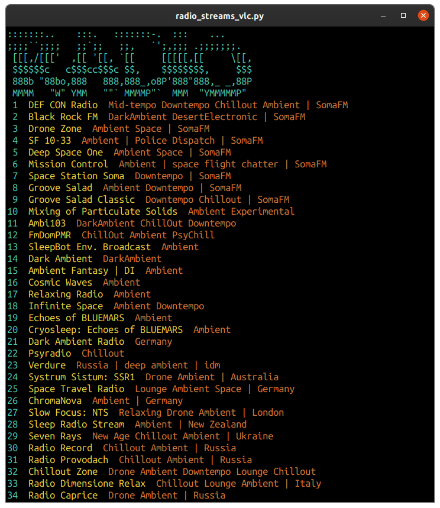
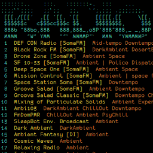

# Radio Streams VLC



## Tested using...

- [Ubuntu 20.04.1 LTS](https://releases.ubuntu.com/20.04/)
- [Python 3.9.0](https://docs.python.org/3.9/)
- [VLC media player](https://snapcraft.io/vlc) 3.0.11

## Check Out thee Fork

Before going any further, check out zcutlip's fork: [zcutlip/chill_streams](https://github.com/zcutlip/chill_streams), which has been much more thoroughly developed and secured.

## vlc_radio_wrapper Module

```python
#!/usr/bin/env python

from subprocess import run
from ascii_art import get_ascii_art
import station_list

print(get_ascii_art())
station_list.get_station_list()

def station_selection():
    urls = station_list.urls
    station_num = int(input('Enter item number: '))
    run(['/snap/bin/vlc', '--intf', 'ncurses', urls[station_num]], check=True)

if __name__ == '__main__':
    station_selection()
```

The `#!` sequence is a Unix shebang which appears at the top line of executable text files. That human-readable sequence translates to hexadecimal numbers, called [magic numbers](https://en.wikipedia.org/wiki/Shebang_(Unix)#Magic_number): `0x23 0x21`. Following the shebang would be a path to the program interpreter. In this case it is the Python interpreter: `#!/usr/bin/env python`, which enables an executable text file to be started at the terminal's `$` command line prompt with the sequence `$ ./app.py`.

```python
>>> hex(ord('#'))
'0x23'
>>> hex(ord('!'))
'0x21'
```

```python
from subprocess import run
from ascii_art import get_ascii_art
import station_list
```

The `subprocess.run()` method enables a Python application to access the CLI. For example, the instruction...

```python
`run(['/snap/bin/vlc', '--intf', 'ncurses', urls[station_num]], check=True)`
```

...becomes the arguments `$ /snap/bin/vlc --intf ncurses http://ice3.somafm.com/defcon-128-aac` in the terminal emulator's command line.

The remaining imports are for the ASCII art heading and printed station list described in the next two sections.

```python
print(get_ascii_art())
station_list.get_station_list()
```

After the ASCII art heading prints, the station list prints, which displays available internet radio stations. Followed by a prompt, where the user enters the number which corresponds with the radio station they want to listen to.

```python
def station_selection():
    urls = station_list.urls
    station_num = int(input(Enter item number: '))
    run(['/snap/bin/vlc', '--intf', 'ncurses', urls[station_num]], check=True)
```

The dictionary `station_list.urls` contains the station data generated by `station_list.get_station_list()`. Then the instruction `int(input(Enter item number: '))` prompts the user for the _item number_. Finally, the `subprocess.run()` method is called, as described above.

```python
if __name__ == '__main__':
    station_selection()
```

The final `if` block checks the `__name__` string for `__main__`. If the name is `__main__`, that means `station_selection()` is called and `app.py` runs as a standalone application.

## ascii_art Module

```python
def get_ascii_art():
    radio = '''\x1b[38;2;72;201;176m
:::::::..    :::.   :::::::-.  :::    ...
;;;;``;;;;   ;;`;;   ;;,   `';,;;; .;;;;;;;.\x1b[38;2;244;208;63m
 [[[,/[[['  ,[[ '[[, `[[     [[[[[,[[     \[[,
 $$$$$$c   c$$$cc$$$c $$,    $$$$$$$$,     $$$\x1b[38;2;220;118;51m
 888b "88bo,888   888,888_,o8P'888"888,_ _,88P
 MMMM   "W" YMM   ""` MMMMP"`  MMM  "YMMMMMP"\x1b[0m'''

    return radio
```

The `ascii_art` module returns color-schemed ASCII art which becomes the header at the top of the station list.

## station_list Module

```python
from csv import reader

urls = {}

def get_station_list():
    c1 = '\x1b[38;2;72;201;176m'
    c2 = '\x1b[38;2;244;208;63m'
    c3 = '\x1b[38;2;220;118;51m'
    res = '\x1b[0m'

    with open('/home/foo/scripts/vlc_radio_wrapper/csv/stations.csv') as csv_file:
        csv_rec_list = list(enumerate(reader(csv_file), 1))
        for num, rec in csv_rec_list:
            print(f'{c1}{num:>2}{res}  {c2}{rec[0]:}{res}  {c3}{rec[1]}{res}')
            urls[num] = rec[2]
```

The `station_list` module is imported by the `vlc_radio_wrapper` module, so it can be accessed with the following instruction:

```python
station_list.get_station_list()
```

The `station_list` module generates an enumerated, color-schemed list of station names/genres. The string `\x1b[38;2;72;201;176m` exemplifies a RGB color formatting sequence, followed by `\x1b[0m` which resets color formatting to default.

The `with open()` statement then opens the CSV database which contains internet radio station data used for station selection, along with URLs for various stations. The resulting file object is passed to the `csv.reader()` method. The resulting CSV reader object is passed to enumerate to be numbered, then to `list()` 

## Desktop Launcher



```shell
[Desktop Entry]
Version=1.1
Type=Application
Name=Radio Streams VLC
GenericName=Radio Streams VLC
Comment=Displays list of Internet radio stations to choose from.
Icon=/usr/share/icons/foo/256x256/radio_streams_vlc.png
TryExec=xterm
Exec=xterm -fa "monofur" -fs 10 -geometry 90x60+0 -e /home/foo/scripts/radio_streams_vlc/app.py
Path=/home/foo/scripts/radio_streams_vlc/
Terminal=true
Actions=
Categories=Audio;Player;
```

To list available fonts: `fc-list | cut -f2 -d: | sort -u | grep -i Mono`

[](https://ko-fi.com/R6R72LISM)
