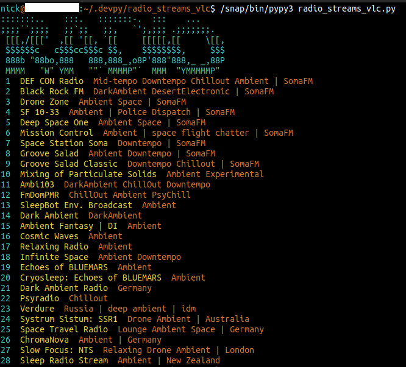

# Radio Streams VLC



`radio_streams_vlc` is a VLC wrapper written in Python3, made available under [MIT](https://opensource.org/licenses/MIT) license.

`station_selection()` wraps the [VLC media player](https://en.wikipedia.org/wiki/VLC_media_player), used as a command-line application to stream Internet radio.

This script was tested with Python 3.6.9/PyPy 7.3.0.

## .bashrc

```bash
export PATH="$PATH:$HOME/scripts"
export PYTHONUSERDIR="$HOME"
```

## Start the App

```bash
$ /snap/bin/pypy3 radio_streams_vlc.py
```

`station_selection()` has an [open()](https://docs.python.org/3/library/functions.html#open) method which creates a text stream from a CSV database which will be used to generate a CSV [reader](https://docs.python.org/3/library/csv.html#csv.reader) object for data base iteration.

In the terminal emulator, first an ASCII banner prints, followed by a list of numbered Internet radio station descriptions. The numbers will be used by listeners to manually enter their choice where prompted.

```python
for number, record in enumerate(_reader, 1):
    print(f'{cyan}{number:>2}{reset}  {yelo}{record[0]:}{reset}  {orng}{record[1]}{reset}')  # print radio station list
    urls[number] = record[2]
```

The `enumerate(_reader, 1)` call generates station descriptions with numbers, starting at `1`. Which are appended to `urls` dictionary. The listener enters their choice, which is quickly grabbed from the object's hash table.

## subprocess.run()

The `run()` method has a similar effect to sourcing a Bash shell script.

>If _check_ is true, and the process exits with a non-zero exit code, a [CalledProcessError](https://docs.python.org/3/library/subprocess.html#subprocess.CalledProcessError) exception will be raised. Attributes of that exception hold the arguments, the exit code, and stdout and stderr if they were captured.[1]

```python
run(['/snap/bin/vlc', '--intf', 'ncurses', urls[station_num]], check=True)
```

The Python instruction above becomes sourced in a Bash CLI, as demonstrated below:

```bash
$ /snap/bin/vlc --intf ncurses https://somafm.com/missioncontrol130.pls
```

### Banner

```text
:::::::..    :::.   :::::::-.  :::    ...     
;;;;``;;;;   ;;`;;   ;;,   `';,;;; .;;;;;;;.
 [[[,/[[['  ,[[ '[[, `[[     [[[[[,[[     \[[,
 $$$$$$c   c$$$cc$$$c $$,    $$$$$$$$,     $$$
 888b "88bo,888   888,888_,o8P'888"888,_ _,88P
 MMMM   "W" YMM   ""` MMMMP"`  MMM  "YMMMMMP"
```

The ASCII art above comes from `ascii_radio.txt` which was generated using `pyfiglet`. A `with open()` block was used to print the ASCII art from the text stream line by line.

## Interface

`--intf ncurses` displays a GUI in the terminal (press 'h' for the help display)

1. https://docs.python.org/3/library/subprocess.html#subprocess.run
